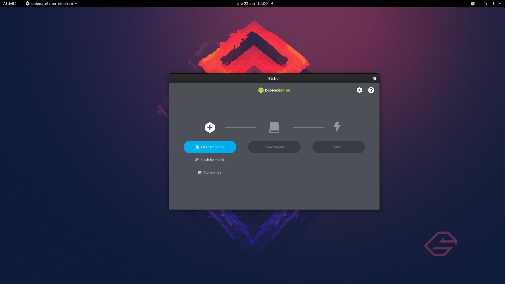

# Preparare l'installazione

## 1. Scaricare la ISO di installazione

Per prima cosa sarà necessario scaricare la ISO di installazione dal loro sito ufficiale

>
	https://getfedora.org/it/

Qui potrete andare a selezionare la versione WorkStation e quindi procedere con lo scaricamento del file ISO, andando a selezionare preferibilmente (se il vostro computer lo supporti) la versione a 64 bit. \
Se avete un computer che supporta solo la versione 32bit, non consiglio di utilizzare questo sistema operativo, visto che non sono rimasti molti software che supportano in modo completo tale architettura ormai datata.

## 2. Procedere con il download di un tool per masterizzare la ISO

Procedere quindi con lo scaricamento di un tool che vi consentirà di masterizzare la ISO in una chiavetta. Il software che vi consiglio si chiama balenaEtcher

>
	https://www.balena.io/etcher/

## 3. Scegliere una chiavetta USB

Scegliere almeno una chiavetta USB da 4GB

## 4. Seguire le istruzioni di balenaEtcher

Seguire le istruzioni del programma per masterizzare la iso nella chiavetta in modo corretto.

