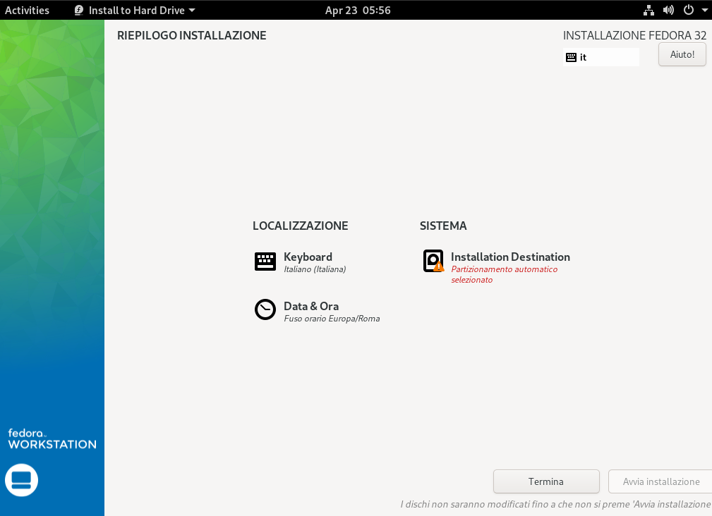

# Procedere con l'installazione

Nella guida utilizzeremo un file ISO di Fedora 32, ma il procedimento è uguale anche con versioni più recenti (come la 33 o 34)

## 1. Selezionare Installa

Alla richiesta se si vuole provare la distro o procedere con la sua installazione scegliere

*Scegliere l'opzione installa*

## 2. Scegliere la lingua

Procedere con la selezione della lingua. Nel mio caso andrò a scegliere l'italiano. 

*Procedere con la scelta della lingua*

## 3. Procedere con le successive fasi di installazione

Procedere quindi, arrivati a questo punto, con l'impostare il vostro disco di installazione e quindi procedere con l'installazione.\ 
È consigliabile installare Fedora in un disco vuoto, per rendere il procedimento più semplice e limitando al minimo gli eventuali rischi che qualcosa possa andare storto.

*Procedere con la scelta della partizione*

## 4. Procedere con l'installazione vera e propria

Procedere quindi con l'installazione su disco

## 5. Riavviare

Terminata la fase di installazione che può richiedere circa 10 minuti, riavviare il sistema premurandosi di rimuovere la chiavetta USB dal PC